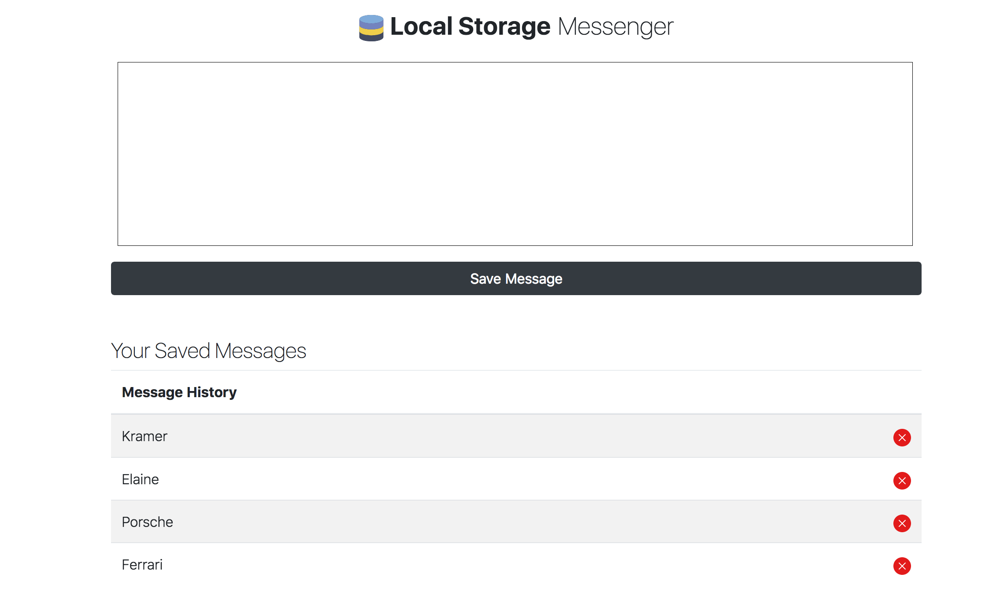

# JS-LocalStorage-Messages
A small yet simple JS application for displaying how stuff is saved through Local Storage.

##### Using the application
###### Steps
>1. Download the Repo
>2. Run the project via a server or a PHP Interpreter.
>3. Simply input messages into the textarea and those messages will remain in the table below no matter how much time goes by until the local storage data is deleted or manually removed through the UI.

